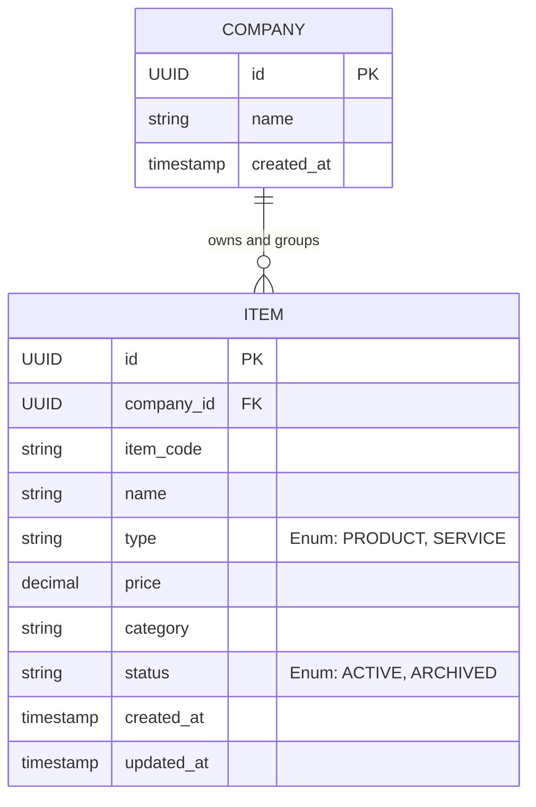

# Product & Service Management - PRD Breakdown

## 1. Requirement Summary

- **Objektif**: Menyediakan modul untuk Business Owner/Admin dalam mengelola entitas produk dan jasa secara terpusat pada tingkat perusahaan (company).
- **In-Scope**:
  - *Create*: Pembuatan entitas item baru dengan atribut wajib (kode, nama, tipe, harga, kategori).
  - *Read*: Pengambilan daftar item milik suatu *company* dengan kapabilitas *filtering* (terutama berdasarkan status arsip) dan pengambilan detail item.
  - *Update*: Pembaruan atribut data item aktif.
  - *Archive*: Pengarsipan item (soft-delete semantik parsial), yang membekukan kapabilitas pembaruan di masa depan.
- **Out-of-Scope**:
  - Manajemen stok/inventori (tidak disinggung).
  - Manajemen multi-currency (diasumsikan menggunakan single base currency standar sistem).
  - Fungsionalitas *unarchive* atau pemulihan data (secara eksplisit item arsip tidak boleh diperbarui kembali).

## 2. Business Rules

1. **Item Type**: Atribut `type` harus di-restrict dan tervalidasi secara ketat hanya menerima enumerasi `[PRODUCT, SERVICE]`.
2. **Initial State**: Registrasi item baru akan memaksa inisialisasi state ke status `ACTIVE`.
3. **Identifier Uniqueness**: `item_code` wajib bersifat *unique* dalam ruang lingkup satu *company* (`company_id`). Duplikasi antar *company* yang berbeda diizinkan.
4. **Immutability by State**: Entitas yang berstatus `ARCHIVED` masuk ke dalam kondisi *immutable* (tidak bisa dilakukan operasi `UPDATE`). Setiap *request* modifikasi terhadap item berstatus `ARCHIVED` harus di-reject dengan HTTP 400 Bad Request atau 422 Unprocessable Entity.
5. **Visibility rules**: 
   - Pengambilan daftar item (GET List) wajib menerapkan filter *default* `status = ACTIVE`.
   - Entitas dengan status `ARCHIVED` eksklusif ditampilkan jika *query parameter* status mencantumkan `ARCHIVED`.
6. **API Consistency**: Semua *request* dan *response* wajib mengikuti konvensi standar (*envelope*) HTTP, mencakup struktur `data`, `meta` (untuk *pagination*), dan kode error kustom/spesifik pada *response payload*.
7. **Price Constraints**: Atribut harga (`price`) wajib divalidasi pada saat pembuatan dan pembaruan item. Nilai harga tidak boleh negatif (`price >= 0`).

## 3. Entity / Domain Model

| Attribute | Data Type | Constraint & Invariant | Description |
| :--- | :--- | :--- | :--- |
| `id` | `UUID` | Primary Key, Auto-generated | Unique identifier secara global. |
| `company_id` | `UUID` | Foreign Key, Not Null | Mengacu ke entitas spesifik *Company*. |
| `item_code` | `VARCHAR` | Not Null, Composite Unique | Di-index komposit bersama `company_id`. |
| `name` | `VARCHAR` | Not Null | Nama representatif produk/jasa. |
| `type` | `ENUM` | Not Null, `['PRODUCT', 'SERVICE']` | Klasifikasi absolut. |
| `price` | `DECIMAL(19,4)` | Not Null, `>= 0` | Menyimpan nominal moneter, dilarang memakai `FLOAT`. |
| `category` | `VARCHAR` | Nullable | Klasifikasi sekunder untuk produk/jasa. |
| `status` | `ENUM` | Not Null, Default `ACTIVE`, `['ACTIVE', 'ARCHIVED']` | Mengontrol lifecycle record. |
| `created_at` | `TIMESTAMP` | Not Null, System Generated | Audit trail. |
| `updated_at` | `TIMESTAMP` | Not Null, System Generated | Diperbarui via *trigger*/*middleware* setiap iterasi. |

## 4. Simple Entity Relationship Diagram (ERD)



## 5. API Specification

*Global Response Envelope (Success):* `{"status": "success", "message": "...", "data": {}, "meta": {}}`
*Global Response Envelope (Error):* `{"status": "error", "message": "...", "code": "...", "errors": []}`

| Endpoint | Method | Headers | Body Schema / Query Params | Expected Status Codes |
| :--- | :--- | :--- | :--- | :--- |
| `/api/v1/companies/{company_id}/items` | `POST` | `Authorization` | `{"item_code": "STR", "name": "STR", "type": "ENUM", "price": "NUM", "category": "STR"}` | `201 Created`, `400 Bad Request`, `401 Unauthorized`, `409 Conflict` (Duplicate Code), `422 Unprocessable Entity` |
| `/api/v1/companies/{company_id}/items` | `GET` | `Authorization` | Query: `?status=STR&page=NUM&limit=NUM` | `200 OK`, `400 Bad Request` |
| `/api/v1/companies/{company_id}/items/{id}` | `GET` | `Authorization` | *None* | `200 OK`, `404 Not Found` |
| `/api/v1/companies/{company_id}/items/{id}` | `PUT` | `Authorization` | `{"name": "STR", "type": "ENUM", "price": "NUM", "category": "STR"}` (Tolak jika status item ARCHIVED) | `200 OK`, `400 Bad Request`, `404 Not Found`, `422 Unprocessable Entity` |
| `/api/v1/companies/{company_id}/items/{id}/archive` | `PATCH` | `Authorization` | *None* (Mengubah state internal tanpa payload ekstensif) | `200 OK`, `400 Bad Request` (Jika sudah arsip), `404 Not Found` |

## 6. Minimal OpenAPI Specification

```yaml
openapi: 3.0.0
info:
  title: Product & Service Management API
  version: 1.0.0
paths:
  /api/v1/companies/{company_id}/items:
    post:
      summary: Create a new item
      parameters:
        - in: path
          name: company_id
          required: true
          schema:
            type: string
            format: uuid
      requestBody:
        required: true
        content:
          application/json:
            schema:
              type: object
              required: [item_code, name, type, price]
              properties:
                item_code:
                  type: string
                name:
                  type: string
                type:
                  type: string
                  enum: [PRODUCT, SERVICE]
                price:
                  type: number
                  format: double
                category:
                  type: string
      responses:
        '201':
          description: Item created successfully
        '409':
          description: Conflict, item_code already exists for this company
    get:
      summary: List items
      parameters:
        - in: path
          name: company_id
          required: true
          schema:
            type: string
            format: uuid
        - in: query
          name: status
          schema:
            type: string
            enum: [ACTIVE, ARCHIVED]
          description: Filter by status. Defaults to ACTIVE.
      responses:
        '200':
          description: A paginated list of items
components:
  schemas:
    Item:
      type: object
      properties:
        id:
          type: string
          format: uuid
        company_id:
          type: string
          format: uuid
        item_code:
          type: string
        name:
          type: string
        type:
          type: string
          enum: [PRODUCT, SERVICE]
        price:
          type: number
        status:
          type: string
          enum: [ACTIVE, ARCHIVED]
```

## 7. Key Risks & Edge Cases

- **Race Condition / Concurrency Issue saat Create/Update**: 
  - *Risk*: Request `POST` ganda dalam hitungan milidetik dengan payload yang sama berpotensi melangkahi validasi ORM/Application level, sehingga menghasilkan dua entitas dengan `item_code` identik dalam satu *company*.
  - *Mitigasi*: Enforce *Unique Constraint* pada level database (`UNIQUE INDEX (company_id, item_code)`). Hal ini bertindak sebagai benteng terakhir dari inkonsistensi data. Tangkap `DatabaseException` (seperti *Integrity Constraint Violation*) dan petakan ke HTTP Error 409 Conflict secara seragam.
- **Data Precision Loss**:
  - *Risk*: Penyimpanan moneter (`price`) menggunakan tipe `Float` / `Double` pada RDBMS menyebabkan kesalahan akumulasi desimal di level *rounding*.
  - *Mitigasi*: Implementasi tipe data strict `DECIMAL(19,4)` atau `NUMERIC` di level *schema database*.
- **Data Leakage lintas Company**:
  - *Risk*: User dari *Company A* memanipulasi UUID di *path parameter* atau *payload* untuk memodifikasi atau membaca item dari *Company B* (IDOR vulnerability).
  - *Mitigasi*: Middleware *authorization* harus memastikan token milik user saat ini terikat dengan `company_id` yang sedang diakses, dan query database wajib membubuhkan *clause* `WHERE company_id = ?`.
- **Performance Downgrade pada Aggregation/Listing**:
  - *Risk*: Tanpa *indexing* yang tepat, query *filtering* berdasarkan state `status` secara berulang lambat laun memakan latensi tinggi (Table Scan).
  - *Mitigasi*: Menambahkan *Composite Index* untuk `(company_id, status)` dan `(company_id, item_code)` untuk performa query yang linear.
- **Edge Case Transisi State**:
  - *Risk*: Percobaan modifikasi parsial pada status *item* melewati *endpoint* update standar (`PUT`), mem-bypass aturan "Item yang sudah diarsipkan tidak boleh diperbarui".
  - *Mitigasi*: Implementasi metode isolasi (misalnya `PATCH .../archive` untuk spesifik state transition) dan mengabaikan parameter `status` jika dikirim ke API `PUT`. Tambahkan explicit validator: jika rekaman eksisting adalah `status == ARCHIVED`, langsung *return* `HTTP 422`.
