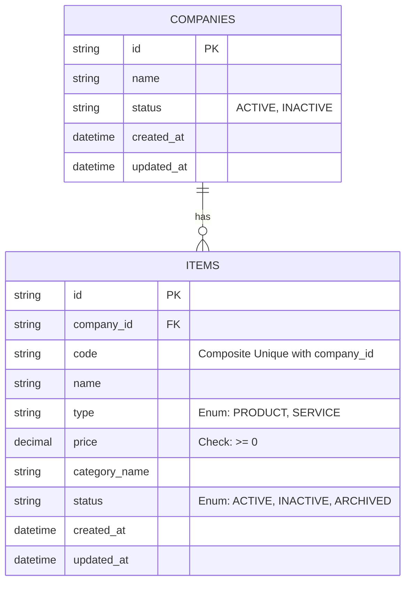

# Product & Service Management (V2) - Architecture Breakdown

## 1. Requirement Summary

- **Objektif**: Menyediakan kapabilitas komprehensif bagi Business Owner/Admin untuk melakukan manajemen siklus hidup produk dan jasa (pembuatan, pembacaan, pembaruan, dan pengarsipan).
- **In-Scope**:
  - Dukungan multitipe item (`PRODUCT` dan `SERVICE`).
  - Pembuatan item dengan constraint duplikasi *code* dalam satu scope *company*.
  - Pembaruan dan penampilan detail/list item dengan filter status/type/keyword.
  - Skema *soft-delete* dengan menggunakan state `ARCHIVED`.
  - Isolasi data ketat berbasis *company* (Multitenancy dasar).
- **Out-of-Scope**:
  - Manajemen stok/inventaris, transaksi pemesanan/pembelian, histori harga.
  - Alur approval, *hard delete* data, manajemen multitipe cabang, *bulk import*, dan unggah gambar.

## 2. Business Rules

1. **Mandatory Field Validations**:
   - `name`: Wajib diisi (Not Null/Empty).
   - `code`: Wajib diisi (Not Null/Empty).
   - `type`: Wajib diisi dan divalidasi secara ketat (*strict enumeration*) hanya untuk nilai `PRODUCT` atau `SERVICE`. Jika di luar nilai ini, kembalikan `400 VALIDATION_ERROR`.
   - `price`: Wajib diisi dan dikalkulasi secara numerik. Nilainya tidak boleh negatif (`price >= 0`). Jika negatif, kembalikan `400 VALIDATION_ERROR`.
2. **Identifier Uniqueness**: `code` harus *unique* di dalam ruang lingkup satu *company* (`company_id`). *Company* yang berbeda diizinkan memiliki *item code* yang sama.
3. **State Initialization**: Registrasi item baru akan menetapkan state status *default* menjadi `ACTIVE`.
4. **Data Isolation (Multitenancy)**: Seluruh operasi (Create, Read, Update, Archive) wajib divalidasi otorisasi kepemilikannya. *Item* hanya boleh diakses atau dimodifikasi dalam *scope company* terkait. Akses lintas *company* dilarang keras (`404` atau `403`).
5. **State Transition & Immutability**:
   - `ACTIVE` / `INACTIVE` -> `ARCHIVED` diizinkan.
   - Entitas berstatus `ARCHIVED` bersifat *immutable*. Segala bentuk percobaan pembaruan (*Update*) atau pengarsipan ulang (*Archive*) harus ditolak (kembalikan error `409 ITEM_ALREADY_ARCHIVED`).
6. **Visibility Rules**: Secara default, *list item* mem-bypass entitas berstatus `ARCHIVED`. Entitas arsip hanya akan di-kueri jika *user* mengirimkan parameter filter spesifik `status=ARCHIVED`.
7. **API Uniformity**: Reponse sukses dan error wajib mengikuti format JSON standar secara konsisten dengan field minimal: `success` (boolean), `code` (string kode status/error), dan `message`.

## 3. Entity / Domain Model

| Attribute | Data Type | Constraint & Invariant | Description |
| :--- | :--- | :--- | :--- |
| `id` | `VARCHAR/UUID` | Primary Key, Not Null | ID unik identitas entitas item. |
| `company_id` | `VARCHAR/UUID` | Foreign Key, Not Null | Relasi ke entitas `companies`. |
| `code` | `VARCHAR` | Not Null, Unique Index | Unique index secara komposit: `(company_id, code)`. |
| `name` | `VARCHAR` | Not Null | Nama produk/jasa. |
| `type` | `ENUM` | Not Null, `['PRODUCT', 'SERVICE']` | Tipe item. |
| `price` | `DECIMAL(19,4)` | Not Null, `>= 0` | Harga dalam presisi desimal tanpa potensi *floating point loss*. |
| `category_name` | `VARCHAR` | Nullable/Optional | Nama kategori dari item. |
| `status` | `ENUM` | Not Null, `['ACTIVE', 'INACTIVE', 'ARCHIVED']` | Status transisi siklus hidup item. |
| `created_at` | `TIMESTAMP` | Not Null | Waktu rekam entitas dibuat. |
| `updated_at` | `TIMESTAMP` | Not Null | Waktu rekam entitas terakhir dimodifikasi. |

## 4. Simple Entity Relationship Diagram (ERD)



## 5. API Specification

*Global Success Structure:* `{"success": true, "code": "...", "message": "...", "data": ...}`
*Global Error Structure:* `{"success": false, "code": "...", "message": "...", "errors": [...]}`

| Endpoint | Method | Required Auth | Body Schema / Query Params | Expected Status Codes |
| :--- | :--- | :--- | :--- | :--- |
| `/companies/{company_id}/items` | `POST` | Yes | `{"code":"str", "name":"str", "type":"PRODUCT|SERVICE", "price":"num(>=0)", "category_name":"str"}` | `201` (ITEM_CREATED), `400` (VALIDATION_ERROR), `409` (ITEM_CODE_ALREADY_EXISTS) |
| `/companies/{company_id}/items` | `GET` | Yes | Query: `?type=str&status=str&keyword=str` | `200` (ITEM_LIST_RETRIEVED) |
| `/companies/{company_id}/items/{id}` | `GET` | Yes | *None* | `200` (ITEM_DETAIL_RETRIEVED), `404` (ITEM_NOT_FOUND), `403` (FORBIDDEN) |
| `/companies/{company_id}/items/{id}` | `PATCH` | Yes | `{"name":"str", "type":"PRODUCT|SERVICE", "price":"num", "category_name":"str", "status":"str"}` | `200` (ITEM_UPDATED), `400` (VALIDATION_ERROR), `409` (ITEM_CODE_ALREADY_EXISTS/ITEM_ALREADY_ARCHIVED), `404` |
| `/companies/{company_id}/items/{id}/archive` | `PATCH` | Yes | *None* | `200` (ITEM_ARCHIVED), `409` (ITEM_ALREADY_ARCHIVED), `404` |

## 6. Minimal OpenAPI Specification

```yaml
openapi: 3.0.0
info:
  title: Product & Service Management API
  version: 1.0.0
paths:
  /companies/{company_id}/items:
    post:
      summary: Create a new item
      parameters:
        - in: path
          name: company_id
          required: true
          schema:
            type: string
      requestBody:
        required: true
        content:
          application/json:
            schema:
              type: object
              required: [code, name, type, price]
              properties:
                code:
                  type: string
                name:
                  type: string
                type:
                  type: string
                  enum: [PRODUCT, SERVICE]
                price:
                  type: number
                  minimum: 0
                category_name:
                  type: string
      responses:
        '201':
          description: Created
        '400':
          description: Validation Error
        '409':
          description: Code Already Exists
    get:
      summary: List items
      parameters:
        - in: path
          name: company_id
          required: true
          schema:
            type: string
        - in: query
          name: type
          schema:
            type: string
            enum: [PRODUCT, SERVICE]
        - in: query
          name: status
          schema:
            type: string
            enum: [ACTIVE, INACTIVE, ARCHIVED]
        - in: query
          name: keyword
          schema:
            type: string
      responses:
        '200':
          description: OK
```

## 7. Key Risks & Edge Cases

- **Race Condition on Insert/Update**:
  - *Risk*: Serangan *concurrency* saat beberapa *request* berusaha membuat *item code* identik secara simultan untuk *company* yang sama berpotensi meloloskan data ganda jika hanya divalidasi di *application logic*.
  - *Mitigasi*: Pasang *Database Constraint* tingkat skema secara absolut berupa *Unique Index* pada kolom komposit `(company_id, code)`. Petakan *driver error* seperti *Constraint Violation* dari database ke HTTP `409 ITEM_CODE_ALREADY_EXISTS` secara otomatis.
- **Cross-Tenant Data Exposure (IDOR)**:
  - *Risk*: Ketiadaan validasi ID *company* memungkinkan user A mengakses *items* dari user B lewat ID yang disuntik manual.
  - *Mitigasi*: Eksekusi *tenant isolation middleware* yang memaksa pembacaan token autentikasi di-*inject* bersama query database (`WHERE id = ? AND company_id = ?`).
- **Paging / Memory Exhaustion**:
  - *Risk*: PRD tidak menyatakan adanya sistem *pagination* secara spesifik pada `GET /items`. Pengambilan ribuan baris data serentak dapat merusak memori layanan (*OOM*).
  - *Mitigasi*: Implementasi default *cursor* atau *offset-limit pagination* secara diam-diam (*implicit architecture safety*) bahkan jika dokumen PM belum menyatakannya.
- **Precision Floating Point Loss**:
  - *Risk*: `price` menggunakan tipe primitif seperti float menyebabkan selisih matematis yang rusak saat diserialisasi JSON atau kalkulasi.
  - *Mitigasi*: Skema database wajib memakai tipe data presisi desimal `DECIMAL(19,4)` atau menyimpan nominal menggunakan format konversi ke sub-unit terkecil bertipe `BIGINT` integer bulat (misal: sen/Rupiah desimal).
