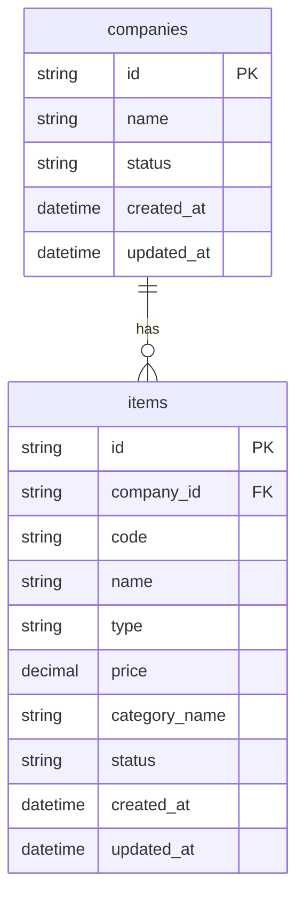

# Product & Service Management

## Overview

Business Owner atau Admin membutuhkan fitur untuk mengelola data produk dan jasa milik perusahaan.

Setiap data yang dikelola disebut sebagai **item**. Item dapat berupa produk fisik maupun jasa layanan. Item memiliki kode, nama, tipe, harga, kategori, dan status.

Sistem harus mendukung pengelolaan item mulai dari membuat item baru, melihat daftar item, melihat detail item, memperbarui item, hingga mengarsipkan item.

Item yang sudah tidak digunakan tidak dihapus secara permanen, tetapi diubah statusnya menjadi `ARCHIVED`. Dengan pendekatan ini, data historis tetap tersimpan dan tidak hilang dari sistem.

---

## Goals

| Goal | Description |
|---|---|
| Mengelola produk dan jasa | User dapat membuat, melihat, memperbarui, dan mengarsipkan data produk/jasa |
| Mendukung tipe item | Sistem mendukung item bertipe `PRODUCT` dan `SERVICE` |
| Mencegah duplicate code | Kode item harus unik dalam satu company |
| Mendukung archive item | Item yang tidak digunakan dapat diarsipkan tanpa hard delete |
| Menjaga data per company | Item hanya dapat diakses dalam scope company terkait |
| Menjaga response konsisten | Semua response API menggunakan format yang konsisten |

---

## Non-Goals

| Non-Goal | Description |
|---|---|
| Stock management | Tidak mencakup pengelolaan stok barang |
| Transaction/order flow | Tidak mencakup transaksi pembelian atau penjualan |
| Pricing history | Tidak mencakup histori perubahan harga |
| Approval flow | Tidak ada approval untuk create/update/archive item |
| Hard delete item | Item tidak dihapus permanen, hanya diarsipkan |
| Multi-branch inventory | Tidak mencakup manajemen item per cabang |
| Bulk import item | Tidak mencakup import produk/jasa secara massal |
| Image upload | Tidak mencakup upload gambar produk/jasa |

---

## Actor

| Actor | Description |
|---|---|
| Business Owner | User yang memiliki akses utama untuk mengelola data company |
| Admin | User yang diberi akses untuk mengelola produk dan jasa |
| System | Backend service yang memproses data produk dan jasa |

---

## User Story

### Mengelola Produk dan Jasa Company

Sebagai **Business Owner/Admin**, saya ingin mengelola data produk dan jasa milik company, agar data tersebut dapat digunakan sebagai referensi operasional bisnis.

Produk dan jasa perlu memiliki informasi dasar seperti kode, nama, tipe, harga, kategori, dan status. Dengan data ini, perusahaan dapat membedakan antara barang dan layanan yang masih aktif, tidak aktif, atau sudah diarsipkan.

---

### Membuat Produk atau Jasa Baru

Sebagai **Business Owner/Admin**, saya ingin membuat data produk atau jasa baru, agar item tersebut dapat tersedia dalam daftar produk dan jasa company.

Setiap item harus memiliki kode yang unik dalam company, sehingga tidak terjadi duplikasi data dan item mudah diidentifikasi.

---

### Melihat Daftar Produk dan Jasa

Sebagai **Business Owner/Admin**, saya ingin melihat daftar produk dan jasa milik company, agar saya dapat memantau item apa saja yang tersedia dan masih digunakan.

Secara default, sistem hanya menampilkan item yang belum diarsipkan, sehingga daftar item tetap relevan untuk kebutuhan operasional harian.

---

### Melihat Detail Produk atau Jasa

Sebagai **Business Owner/Admin**, saya ingin melihat detail produk atau jasa tertentu, agar saya dapat memeriksa informasi lengkap item tersebut sebelum melakukan perubahan.

Detail item hanya boleh dapat diakses jika item tersebut berada dalam company yang sesuai.

---

### Memperbarui Produk atau Jasa

Sebagai **Business Owner/Admin**, saya ingin memperbarui data produk atau jasa, agar informasi item tetap sesuai dengan kondisi bisnis terbaru.

Sistem harus mencegah perubahan yang menyebabkan data tidak valid, seperti harga negatif, tipe item tidak dikenal, atau kode item yang sudah digunakan item lain dalam company yang sama.

---

### Mengarsipkan Produk atau Jasa

Sebagai **Business Owner/Admin**, saya ingin mengarsipkan produk atau jasa yang sudah tidak digunakan, agar item tersebut tidak muncul pada daftar operasional harian tetapi tetap tersimpan untuk kebutuhan riwayat data.

Item yang sudah diarsipkan tidak boleh diperbarui kembali, karena status tersebut menandakan item sudah tidak aktif untuk proses bisnis berjalan.

---

## Acceptance Criteria / Gherkin

### Scenario: Membuat item baru dengan data valid

```gherkin
Given user memiliki akses ke company
And company dalam status aktif
And item code belum digunakan pada company tersebut
When user membuat item baru dengan code, name, type, price, dan category yang valid
Then sistem membuat item baru
And status item menjadi ACTIVE
And sistem mengembalikan response ITEM_CREATED
```

---

### Scenario: Membuat item dengan code yang sudah digunakan

```gherkin
Given user memiliki akses ke company
And sudah ada item dengan code yang sama pada company tersebut
When user membuat item baru menggunakan code tersebut
Then sistem menolak request
And sistem tidak membuat item baru
And sistem mengembalikan error ITEM_CODE_ALREADY_EXISTS
```

---

### Scenario: Membuat item dengan tipe tidak valid

```gherkin
Given user memiliki akses ke company
When user membuat item dengan type selain PRODUCT atau SERVICE
Then sistem menolak request
And sistem tidak membuat item baru
And sistem mengembalikan error VALIDATION_ERROR
```

---

### Scenario: Membuat item dengan harga negatif

```gherkin
Given user memiliki akses ke company
When user membuat item dengan price bernilai negatif
Then sistem menolak request
And sistem tidak membuat item baru
And sistem mengembalikan error VALIDATION_ERROR
```

---

### Scenario: Melihat daftar item default

```gherkin
Given user memiliki akses ke company
And company memiliki beberapa item dengan status ACTIVE, INACTIVE, dan ARCHIVED
When user melihat daftar item tanpa filter status
Then sistem menampilkan item dengan status non-archived
And sistem tidak menampilkan item dengan status ARCHIVED
And sistem mengembalikan response ITEM_LIST_RETRIEVED
```

---

### Scenario: Melihat daftar item dengan filter archived

```gherkin
Given user memiliki akses ke company
And company memiliki item dengan status ARCHIVED
When user melihat daftar item dengan filter status ARCHIVED
Then sistem menampilkan item yang berstatus ARCHIVED
And sistem mengembalikan response ITEM_LIST_RETRIEVED
```

---

### Scenario: Melihat detail item valid

```gherkin
Given user memiliki akses ke company
And item tersedia pada company tersebut
When user melihat detail item
Then sistem menampilkan detail item
And sistem mengembalikan response ITEM_DETAIL_RETRIEVED
```

---

### Scenario: Melihat detail item yang tidak ditemukan

```gherkin
Given user memiliki akses ke company
And item tidak tersedia pada company tersebut
When user melihat detail item
Then sistem menolak request
And sistem mengembalikan error ITEM_NOT_FOUND
```

---

### Scenario: Memperbarui item dengan data valid

```gherkin
Given user memiliki akses ke company
And item tersedia pada company tersebut
And item belum berstatus ARCHIVED
When user memperbarui data item dengan data yang valid
Then sistem memperbarui data item
And sistem mengembalikan response ITEM_UPDATED
```

---

### Scenario: Memperbarui item menjadi duplicate code

```gherkin
Given user memiliki akses ke company
And item A tersedia pada company tersebut
And item B memiliki code yang sudah digunakan pada company yang sama
When user memperbarui code item A menjadi code milik item B
Then sistem menolak request
And sistem tidak memperbarui item
And sistem mengembalikan error ITEM_CODE_ALREADY_EXISTS
```

---

### Scenario: Memperbarui item yang sudah archived

```gherkin
Given user memiliki akses ke company
And item sudah berstatus ARCHIVED
When user mencoba memperbarui data item tersebut
Then sistem menolak request
And sistem tidak memperbarui item
And sistem mengembalikan error ITEM_ALREADY_ARCHIVED
```

---

### Scenario: Mengarsipkan item aktif

```gherkin
Given user memiliki akses ke company
And item tersedia pada company tersebut
And item belum berstatus ARCHIVED
When user mengarsipkan item tersebut
Then sistem mengubah status item menjadi ARCHIVED
And sistem mengembalikan response ITEM_ARCHIVED
```

---

### Scenario: Mengarsipkan item yang sudah archived

```gherkin
Given user memiliki akses ke company
And item sudah berstatus ARCHIVED
When user mencoba mengarsipkan item tersebut
Then sistem menolak request
And sistem mengembalikan error ITEM_ALREADY_ARCHIVED
```

---

### Scenario: Mengakses item milik company lain

```gherkin
Given user memiliki akses ke company A
And item tersedia pada company B
When user mencoba mengakses item tersebut melalui company A
Then sistem tidak menampilkan item tersebut
And sistem mengembalikan error ITEM_NOT_FOUND atau FORBIDDEN sesuai desain keamanan sistem
```

---

## Business Rules

| Rule ID | Rule |
|---|---|
| BR-001 | Item name wajib diisi |
| BR-002 | Item code wajib diisi |
| BR-003 | Item code harus unik dalam satu company |
| BR-004 | Company yang berbeda boleh memiliki item code yang sama |
| BR-005 | Item type hanya boleh `PRODUCT` atau `SERVICE` |
| BR-006 | Price wajib bernilai `0` atau lebih besar |
| BR-007 | Status default item baru adalah `ACTIVE` |
| BR-008 | Item hanya dapat diakses dalam scope company terkait |
| BR-009 | Update item tidak boleh menghasilkan duplicate code dalam company yang sama |
| BR-010 | Item dengan status `ARCHIVED` tidak boleh diperbarui |
| BR-011 | Archive item akan mengubah status item menjadi `ARCHIVED` |
| BR-012 | Archive item yang sudah `ARCHIVED` akan mengembalikan error `ITEM_ALREADY_ARCHIVED` |
| BR-013 | List item default hanya menampilkan item dengan status non-archived |
| BR-014 | Archived item dapat ditampilkan jika user menggunakan filter `status=ARCHIVED` |
| BR-015 | Response sukses dan error harus menggunakan format yang konsisten |

---

## Item Type

| Type | Description |
|---|---|
| PRODUCT | Produk/barang yang dimiliki company |
| SERVICE | Jasa/layanan yang dimiliki company |

---

## Item Status

| Status | Description |
|---|---|
| ACTIVE | Item aktif dan dapat digunakan |
| INACTIVE | Item tidak aktif sementara |
| ARCHIVED | Item sudah diarsipkan dan tidak ditampilkan secara default |

---

## Functional Requirement

### Create Item

User dapat membuat item baru dengan mengisi:

- `code`
- `name`
- `type`
- `price`
- `category_name`

Saat item berhasil dibuat:

- Status default menjadi `ACTIVE`.
- Sistem mengembalikan response `ITEM_CREATED`.
- Sistem menolak request jika item code sudah digunakan dalam company yang sama.
- Sistem menolak request jika type tidak valid.
- Sistem menolak request jika price bernilai negatif.

---

### Get Item List

User dapat melihat daftar item dalam company.

Secara default, daftar item tidak menampilkan item dengan status `ARCHIVED`.

User dapat menggunakan filter:

- `type`
- `status`
- `keyword`

Contoh filter:

```http
GET /companies/{company_id}/items?type=SERVICE&status=ACTIVE&keyword=pajak
```

Ketentuan:

- Filter `type` hanya boleh `PRODUCT` atau `SERVICE`.
- Filter `status` hanya boleh `ACTIVE`, `INACTIVE`, atau `ARCHIVED`.
- Filter `keyword` digunakan untuk mencari berdasarkan `code` atau `name`.

---

### Get Item Detail

User dapat melihat detail item berdasarkan `item_id`.

Sistem harus memastikan item yang diakses adalah milik company terkait.

Jika item tidak ditemukan, sistem mengembalikan error `ITEM_NOT_FOUND`.

---

### Update Item

User dapat memperbarui data item selama item belum berstatus `ARCHIVED`.

Field yang dapat diperbarui:

- `code`
- `name`
- `type`
- `price`
- `category_name`
- `status`

Sistem harus menolak update jika:

- Item tidak ditemukan.
- Item sudah `ARCHIVED`.
- Code baru sudah digunakan item lain dalam company yang sama.
- Type tidak valid.
- Price bernilai negatif.

---

### Archive Item

User dapat mengarsipkan item.

Saat item diarsipkan:

- Status item berubah menjadi `ARCHIVED`.
- Item tidak tampil pada list default.
- Item tetap dapat dilihat jika difilter dengan status `ARCHIVED`.
- Sistem tidak melakukan hard delete.

Jika item sudah `ARCHIVED`, sistem mengembalikan error `ITEM_ALREADY_ARCHIVED`.

---

## API Scope

### Create Item

```http
POST /companies/{company_id}/items
```

### Get Item List

```http
GET /companies/{company_id}/items
```

### Get Item Detail

```http
GET /companies/{company_id}/items/{item_id}
```

### Update Item

```http
PATCH /companies/{company_id}/items/{item_id}
```

### Archive Item

```http
PATCH /companies/{company_id}/items/{item_id}/archive
```

---

## Request and Response Contract

### Standard Success Response

```json
{
  "success": true,
  "code": "STRING_CODE",
  "message": "Success message",
  "data": {}
}
```

### Standard Error Response

```json
{
  "success": false,
  "code": "STRING_CODE",
  "message": "Error message",
  "errors": []
}
```

---

## Create Item API

### Endpoint

```http
POST /companies/{company_id}/items
```

### Request Body

```json
{
  "code": "ITEM-001",
  "name": "Paket Konsultasi Pajak",
  "type": "SERVICE",
  "price": 1500000,
  "category_name": "Konsultasi"
}
```

### Success Response

HTTP Status: `201 Created`

```json
{
  "success": true,
  "code": "ITEM_CREATED",
  "message": "Item created successfully",
  "data": {
    "item_id": "item_001",
    "company_id": "cmp_001",
    "code": "ITEM-001",
    "name": "Paket Konsultasi Pajak",
    "type": "SERVICE",
    "price": 1500000,
    "category_name": "Konsultasi",
    "status": "ACTIVE"
  }
}
```

---

## Get Item List API

### Endpoint

```http
GET /companies/{company_id}/items
```

### Query Parameter

| Parameter | Required | Description |
|---|---|---|
| type | No | Filter berdasarkan `PRODUCT` atau `SERVICE` |
| status | No | Filter berdasarkan `ACTIVE`, `INACTIVE`, atau `ARCHIVED` |
| keyword | No | Pencarian berdasarkan `code` atau `name` |

### Success Response

HTTP Status: `200 OK`

```json
{
  "success": true,
  "code": "ITEM_LIST_RETRIEVED",
  "message": "Item list retrieved successfully",
  "data": [
    {
      "item_id": "item_001",
      "company_id": "cmp_001",
      "code": "ITEM-001",
      "name": "Paket Konsultasi Pajak",
      "type": "SERVICE",
      "price": 1500000,
      "category_name": "Konsultasi",
      "status": "ACTIVE"
    }
  ]
}
```

---

## Get Item Detail API

### Endpoint

```http
GET /companies/{company_id}/items/{item_id}
```

### Success Response

HTTP Status: `200 OK`

```json
{
  "success": true,
  "code": "ITEM_DETAIL_RETRIEVED",
  "message": "Item detail retrieved successfully",
  "data": {
    "item_id": "item_001",
    "company_id": "cmp_001",
    "code": "ITEM-001",
    "name": "Paket Konsultasi Pajak",
    "type": "SERVICE",
    "price": 1500000,
    "category_name": "Konsultasi",
    "status": "ACTIVE"
  }
}
```

---

## Update Item API

### Endpoint

```http
PATCH /companies/{company_id}/items/{item_id}
```

### Request Body

```json
{
  "name": "Paket Konsultasi Pajak Premium",
  "price": 2500000,
  "status": "ACTIVE"
}
```

### Success Response

HTTP Status: `200 OK`

```json
{
  "success": true,
  "code": "ITEM_UPDATED",
  "message": "Item updated successfully",
  "data": {
    "item_id": "item_001",
    "company_id": "cmp_001",
    "code": "ITEM-001",
    "name": "Paket Konsultasi Pajak Premium",
    "type": "SERVICE",
    "price": 2500000,
    "category_name": "Konsultasi",
    "status": "ACTIVE"
  }
}
```

---

## Archive Item API

### Endpoint

```http
PATCH /companies/{company_id}/items/{item_id}/archive
```

### Success Response

HTTP Status: `200 OK`

```json
{
  "success": true,
  "code": "ITEM_ARCHIVED",
  "message": "Item archived successfully",
  "data": {
    "item_id": "item_001",
    "company_id": "cmp_001",
    "status": "ARCHIVED"
  }
}
```

---

## Error Response Reference

### Validation Error

HTTP Status: `400 Bad Request`

```json
{
  "success": false,
  "code": "VALIDATION_ERROR",
  "message": "Validation failed",
  "errors": [
    {
      "field": "type",
      "message": "Type must be PRODUCT or SERVICE"
    }
  ]
}
```

### Duplicate Item Code

HTTP Status: `409 Conflict`

```json
{
  "success": false,
  "code": "ITEM_CODE_ALREADY_EXISTS",
  "message": "Item code already exists in this company",
  "errors": []
}
```

### Item Not Found

HTTP Status: `404 Not Found`

```json
{
  "success": false,
  "code": "ITEM_NOT_FOUND",
  "message": "Item not found",
  "errors": []
}
```

### Company Not Found

HTTP Status: `404 Not Found`

```json
{
  "success": false,
  "code": "COMPANY_NOT_FOUND",
  "message": "Company not found",
  "errors": []
}
```

### Item Already Archived

HTTP Status: `409 Conflict`

```json
{
  "success": false,
  "code": "ITEM_ALREADY_ARCHIVED",
  "message": "Item is already archived",
  "errors": []
}
```

### Unauthorized

HTTP Status: `401 Unauthorized`

```json
{
  "success": false,
  "code": "UNAUTHORIZED",
  "message": "Authentication is required",
  "errors": []
}
```

### Forbidden

HTTP Status: `403 Forbidden`

```json
{
  "success": false,
  "code": "FORBIDDEN",
  "message": "You do not have access to this company",
  "errors": []
}
```

---

## Expected Response Code

| Condition | HTTP Status | Code |
|---|---:|---|
| Item created | 201 | `ITEM_CREATED` |
| Item list retrieved | 200 | `ITEM_LIST_RETRIEVED` |
| Item detail retrieved | 200 | `ITEM_DETAIL_RETRIEVED` |
| Item updated | 200 | `ITEM_UPDATED` |
| Item archived | 200 | `ITEM_ARCHIVED` |
| Validation error | 400 | `VALIDATION_ERROR` |
| Company not found | 404 | `COMPANY_NOT_FOUND` |
| Item not found | 404 | `ITEM_NOT_FOUND` |
| Duplicate item code | 409 | `ITEM_CODE_ALREADY_EXISTS` |
| Item already archived | 409 | `ITEM_ALREADY_ARCHIVED` |
| Unauthorized | 401 | `UNAUTHORIZED` |
| Forbidden | 403 | `FORBIDDEN` |

---

## Data Model

### companies

| Field | Description |
|---|---|
| id | Company ID |
| name | Company name |
| status | `ACTIVE` atau `INACTIVE` |
| created_at | Created timestamp |
| updated_at | Updated timestamp |

### items

| Field | Description |
|---|---|
| id | Item ID |
| company_id | Company owner ID |
| code | Unique code dalam satu company |
| name | Item name |
| type | `PRODUCT` atau `SERVICE` |
| price | Item price |
| category_name | Category name |
| status | `ACTIVE`, `INACTIVE`, atau `ARCHIVED` |
| created_at | Created timestamp |
| updated_at | Updated timestamp |

---

## ERD



---

## Constraint

| Table | Constraint | Purpose |
|---|---|---|
| companies | Primary key `id` | Identitas company |
| items | Primary key `id` | Identitas item |
| items | Foreign key `company_id` | Relasi item ke company |
| items | Unique `company_id + code` | Mencegah duplicate code dalam company yang sama |

---

## Seed Data

### companies

| id | name | status |
|---|---|---|
| cmp_001 | PT Maju Jaya | ACTIVE |
| cmp_999 | PT Tidak Dimiliki | ACTIVE |

### items

| id | company_id | code | name | type | price | category_name | status |
|---|---|---|---|---|---:|---|---|
| item_001 | cmp_001 | ITEM-001 | Paket Konsultasi Pajak | SERVICE | 1500000 | Konsultasi | ACTIVE |
| item_002 | cmp_001 | ITEM-002 | Software Akuntansi Basic | PRODUCT | 2500000 | Software | ACTIVE |
| item_003 | cmp_001 | ITEM-003 | Layanan Training Pajak | SERVICE | 1000000 | Training | ARCHIVED |
| item_999 | cmp_999 | ITEM-001 | Produk Company Lain | PRODUCT | 500000 | Umum | ACTIVE |

---

## Non-Functional Requirements

| Category | Requirement |
|---|---|
| Security | Item hanya dapat diakses dalam scope company terkait |
| Security | Response tidak boleh mengekspos data internal yang tidak diperlukan |
| Reliability | Duplicate item code harus dicegah di level application dan database constraint |
| Maintainability | Business logic tidak boleh menumpuk di controller |
| Maintainability | Response sukses dan error harus konsisten |
| Performance | Query list item harus tetap efisien meskipun data bertambah |
| Testability | Business logic harus dapat diuji dengan testcase yang jelas |
| Observability | Error utama sebaiknya tercatat dalam log aplikasi |

---

## Testcase Reference

| Testcase ID | Scenario | Expected Result |
|---|---|---|
| TC-001 | Create item valid | `201 ITEM_CREATED` |
| TC-002 | Create item dengan duplicate code | `409 ITEM_CODE_ALREADY_EXISTS` |
| TC-003 | Create item dengan type invalid | `400 VALIDATION_ERROR` |
| TC-004 | Create item dengan price negatif | `400 VALIDATION_ERROR` |
| TC-005 | Get list item | `200 ITEM_LIST_RETRIEVED` |
| TC-006 | Get detail item valid | `200 ITEM_DETAIL_RETRIEVED` |
| TC-007 | Get detail item tidak ditemukan | `404 ITEM_NOT_FOUND` |
| TC-008 | Update item valid | `200 ITEM_UPDATED` |
| TC-009 | Update item menjadi duplicate code | `409 ITEM_CODE_ALREADY_EXISTS` |
| TC-010 | Archive item valid | `200 ITEM_ARCHIVED` |
| TC-011 | Archive item yang sudah archived | `409 ITEM_ALREADY_ARCHIVED` |
| TC-012 | Update archived item | `409 ITEM_ALREADY_ARCHIVED` |
